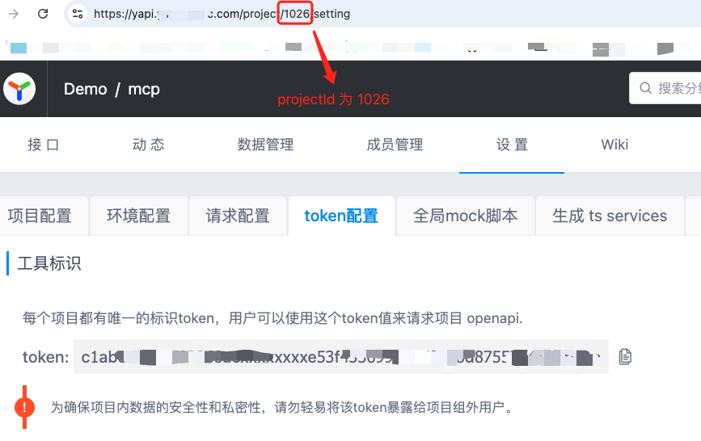
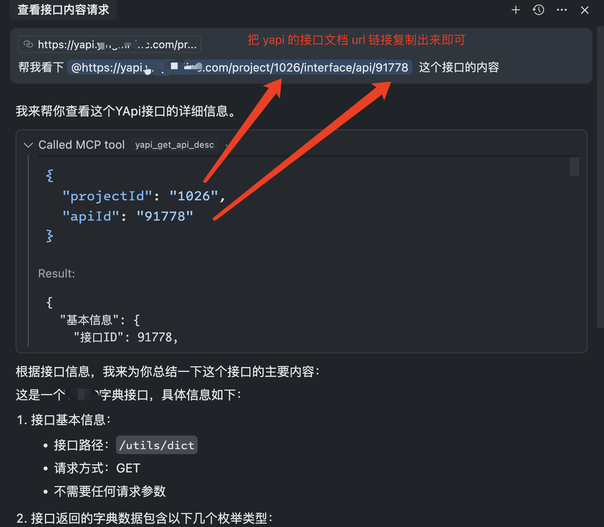

# Yapi MCP Server

## 环境配置

在项目根目录创建 `.env` 文件，并配置以下环境变量：

```env
# Yapi项目配置

# Server configuration
PORT=3388

# Token配置
# 多项目Token格式: projectId:token,projectId:token
YAPI_TOKEN=projectId:your_yapi_token_here,projectId2:your_yapi_token2_here

# 项目基础URL
YAPI_BASE_URL=your_yapi_base_url_here

# 缓存时效(分钟)，默认360分钟(6小时)
YAPI_CACHE_TTL=360

# 日志级别: debug, info, warn, error, none
# - debug: 输出所有日志，包括详细的调试信息
# - info: 输出信息、警告和错误日志(默认)
# - warn: 只输出警告和错误日志
# - error: 只输出错误日志
# - none: 不输出任何日志
YAPI_LOG_LEVEL=info
```


## MCP Server 启动
```bash
pnpm install
pnpm run dev
```

## 如何获取 token

该 token 配置在.env 文件中示例：
```env
YAPI_TOKEN=1026:c1abxxxxxxxxxx
```

## 在Cursor中使用
```json
{
  "mcpServers": {
    "yapi-mcp": {
      "url": "http://localhost:3388/sse"
    },
    ...其它MCP Server配置
  }
}
```


## 使用例子


## Available Tools

The server provides the following MCP tools:

### yapi_get_api_desc

获取YApi中特定接口的详细信息。

### yapi_save_api

新增或更新YApi中的接口信息。

### yapi_search_apis

搜索YApi中的接口。


### yapi_list_projects

列出YApi的项目ID(projectId)和项目名称。


### yapi_get_categories

获取YApi项目下的接口分类列表，以及每个分类下的接口信息。


### get_api_desc

获取指定的yapi接口.
