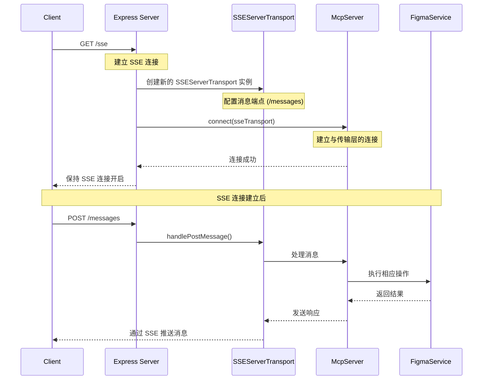

```mermaid
sequenceDiagram
    participant Client
    participant Express Server
    participant SSEServerTransport
    participant McpServer
    participant FigmaService

    Client->>Express Server: GET /sse
    Note over Express Server: 建立 SSE 连接

    Express Server->>SSEServerTransport: 创建新的 SSEServerTransport 实例
    Note over SSEServerTransport: 配置消息端点 (/messages)

    Express Server->>McpServer: connect(sseTransport)
    Note over McpServer: 建立与传输层的连接

    McpServer-->>Express Server: 连接成功
    Express Server-->>Client: 保持 SSE 连接开启

    Note over Client,FigmaService: SSE 连接建立后
    Client->>Express Server: POST /messages
    Express Server->>SSEServerTransport: handlePostMessage()
    SSEServerTransport->>McpServer: 处理消息
    McpServer->>FigmaService: 执行相应操作
    FigmaService-->>McpServer: 返回结果
    McpServer-->>SSEServerTransport: 发送响应
    SSEServerTransport-->>Client: 通过 SSE 推送消息
```